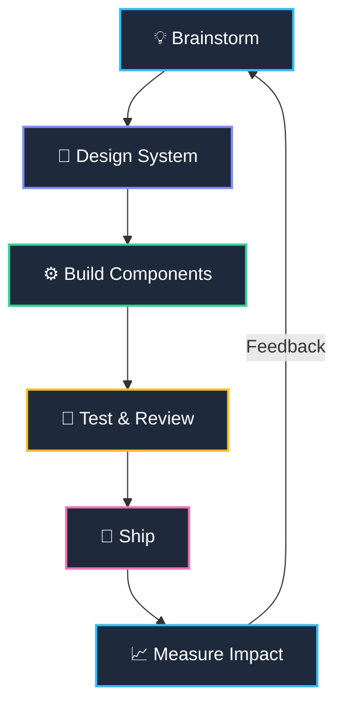

<div align="left">
  

  <h2>Hi, Mohd Mubashir Ahmed (he/him) 👋</h2>

  <div align="left">


💻 Computer Enthusiast &nbsp;|&nbsp; 🤝 Collaboration Lover &nbsp;|&nbsp; ⚙️ System Builder

</div>

I'm a computer enthusiast at heart 💻 — genuinely fascinated by how systems come together and work.

I thrive on collaborating with new people 🤝 on projects, whether that means learning from them or teaching what I know; the exchange is where the real growth happens 🌱.

I'm passionate 🔥 about building new systems from the ground up, and I'm crazy about data 📊 — how it behaves, what it reveals, and how it shapes user experience ✨.

My goal is to grow into a **Software Engineer** who delivers systems that don't just work, but genuinely **inspire awe** 🚀.

<div align="left">


</div>


</div>

---
### Tech Stack 🛠️


<div align="center">

## 🧩 Skills & Their Role in Modern Software Development

*How each technology shows up across the product lifecycle*

</div>

<br/>

<table width="100%">
  <thead>
    <tr>
      <th align="center" width="14%">Tech</th>
      <th align="left" width="28.6%">🎨&nbsp; Design</th>
      <th align="left" width="28.6%">⚙️&nbsp; Development</th>
      <th align="left" width="28.6%">🚀&nbsp; Optimization</th>
    </tr>
  </thead>
  <tbody>
    <tr>
      <td align="center"></td>
      <td>Defines the semantic document structure and information architecture of an application</td>
      <td>Serves as the foundational markup layer on which all UI components are rendered</td>
      <td>Enhances accessibility compliance and search engine discoverability</td>
    </tr>
    <tr>
      <td align="center"></td>
      <td>Establishes visual hierarchy, layout systems, and responsive design specifications</td>
      <td>Implements consistent styling and cross-device presentation logic</td>
      <td>Refines interaction design through transitions, theming, and visual polish</td>
    </tr>
    <tr>
      <td align="center"></td>
      <td>Models dynamic behavior and client-side interaction patterns during architecture planning</td>
      <td>Drives DOM manipulation, event handling, and integration with external APIs</td>
      <td>Enables performance tuning through asynchronous patterns and runtime profiling</td>
    </tr>
    <tr>
      <td align="center"></td>
      <td>Standardizes design tokens and utility-first conventions across a design system</td>
      <td>Accelerates UI implementation without context-switching between files</td>
      <td>Simplifies large-scale visual refactors and maintains design consistency</td>
    </tr>
    <tr>
      <td align="center"></td>
      <td>Establishes clear data contracts and interfaces during system design</td>
      <td>Enforces compile-time type safety, reducing runtime defects during implementation</td>
      <td>Improves long-term maintainability and confidence in large-scale refactoring</td>
    </tr>
    <tr>
      <td align="center"></td>
      <td>Promotes component-driven architecture and reusable interface design</td>
      <td>Builds dynamic, stateful user interfaces with efficient rendering</td>
      <td>Supports scalable iteration through modular, independently testable components</td>
    </tr>
  </tbody>
</table>

<br/>

<div align="center">
<sub>🎨 Design → ⚙️ Development → 🚀 Optimization &nbsp;|&nbsp; the same stack, three different lenses</sub>
</div>

---

<!--
  ALTERNATE LAYOUT — "card" style
  GitHub READMEs strip <style> tags, so true CSS effects (shadows, hover, gradients)
  aren't possible. This collapsible-card version is the closest thing to a "sleek"
  component-like feel using only badges, emoji, and native <details> accordions.
-->

<div align="center">

## 🧩 Skills & Their Role in Modern Software Development

</div>

<details open>
<summary></summary>
<br/>

| Phase | Role |
|---|---|
| 🎨 **Design** | Defines the semantic document structure and information architecture of an application |
| ⚙️ **Development** | Serves as the foundational markup layer on which all UI components are rendered |
| 🚀 **Optimization** | Enhances accessibility compliance and search engine discoverability |

</details>

<details>
<summary></summary>
<br/>

| Phase | Role |
|---|---|
| 🎨 **Design** | Establishes visual hierarchy, layout systems, and responsive design specifications |
| ⚙️ **Development** | Implements consistent styling and cross-device presentation logic |
| 🚀 **Optimization** | Refines interaction design through transitions, theming, and visual polish |

</details>

<details>
<summary></summary>
<br/>

| Phase | Role |
|---|---|
| 🎨 **Design** | Models dynamic behavior and client-side interaction patterns during architecture planning |
| ⚙️ **Development** | Drives DOM manipulation, event handling, and integration with external APIs |
| 🚀 **Optimization** | Enables performance tuning through asynchronous patterns and runtime profiling |

</details>

<details>
<summary></summary>
<br/>

| Phase | Role |
|---|---|
| 🎨 **Design** | Standardizes design tokens and utility-first conventions across a design system |
| ⚙️ **Development** | Accelerates UI implementation without context-switching between files |
| 🚀 **Optimization** | Simplifies large-scale visual refactors and maintains design consistency |

</details>

<details>
<summary></summary>
<br/>

| Phase | Role |
|---|---|
| 🎨 **Design** | Establishes clear data contracts and interfaces during system design |
| ⚙️ **Development** | Enforces compile-time type safety, reducing runtime defects during implementation |
| 🚀 **Optimization** | Improves long-term maintainability and confidence in large-scale refactoring |

</details>

<details>
<summary></summary>
<br/>

| Phase | Role |
|---|---|
| 🎨 **Design** | Promotes component-driven architecture and reusable interface design |
| ⚙️ **Development** | Builds dynamic, stateful user interfaces with efficient rendering |
| 🚀 **Optimization** | Supports scalable iteration through modular, independently testable components |

</details>

# Product Lifecycle Flow




## 🤝 Collaboration & Philosophy

```text
┌──────────────────────────────────────────────────────────┐
│  "The best interfaces I've built were never solo work."   │
└──────────────────────────────────────────────────────────┘
```

- 🧩 **I brainstorm before I build.** A whiteboard argument saves a week of refactoring.
- 🗣️ **I teach what I learn, and learn from everyone.** Knowledge that stays in one head doesn't scale — neither does software built by one person.
- 🔍 **I design for change.** Systems, not one-off screens — because requirements always shift.
- 🔄 **I treat feedback as fuel.** Code review isn't a gate, it's a conversation.
- 🌍 **I believe in open source** as the purest form of collaborative building.

---

## 📫 Let's Build Something

<div align="center">

[](#)
[](#)
[](#)
[](mailto:your.email@example.com)

<br/>


</div>
